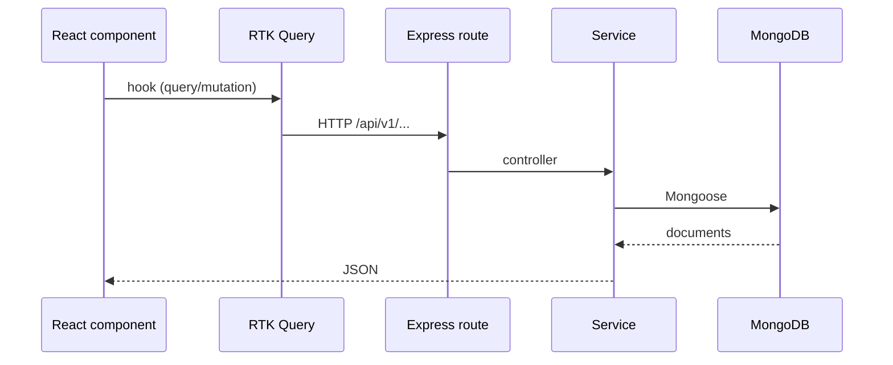

# Architecture

## Runtime topology

| Component | Path | Runtime |
|---|---|---|
| Web UI | `inventory-management-client` | `react-scripts start` (port 3000 by default) |
| HTTP API | `inventroy-management-server` | `node src/server.js` (port from `PORT`, commonly 5000) |
| Database | MongoDB Atlas or other URI in `DATABASE_URL` | Mongoose 8 |

The client sends `credentials: "include"` and `Authorization: Bearer <accesstoken>` from `inventory-management-client/src/redux/api/apiSlice.js`. Base URL is `process.env.REACT_APP_BASE_URL`.

## Request flow



## Frontend folder structure

```
inventory-management-client/
├── public/
├── src/
│   ├── App.js                 # Route table + inactivity logout
│   ├── index.js               # Provider + BrowserRouter
│   ├── components/            # Feature screens (CRUD, reports, sales, purchase)
│   ├── pages/                 # Login, Home (menubar), Dashboard, RequireAuth
│   ├── redux/
│   │   ├── store.js
│   │   ├── api/               # apiSlice, token refresh, authSlice
│   │   └── features/          # One *Api.js per domain
│   ├── lib/firebase.js        # Present; not used by the JWT login page
│   └── buttonStyle/, ...
├── package.json
└── .env                       # REACT_APP_BASE_URL
```

**Important folders**

| Folder | Responsibility |
|---|---|
| `src/pages/Home` | PrimeReact `Menubar` from the logged-in user’s `menulist` |
| `src/pages/Dashboard` | KPI cards + four filtered charts |
| `src/pages/RequireAuth` | URL vs menu permission check |
| `src/components/*` | Feature UI: Insert / Index / Update / Common patterns |
| `src/components/ReportProperties` | PDF and Excel generators |
| `src/components/Uitilites` | Menu permission helper, shared extractors |
| `src/redux/features` | RTK Query endpoint injectors |

There is no `src/pages` split by every entity; many “pages” live under `components/`.

## Backend folder structure

```
inventroy-management-server/
├── src/
│   ├── server.js              # mongoose.connect + listen
│   ├── app.js                 # Express, CORS, multer, routes
│   ├── config/index.js        # DATABASE_URL, PORT, NODE_ENV
│   ├── app/routes/index.js    # Mounts all modules
│   ├── app/middlewares/       # verifyToken, globalErrorHandler, logger
│   ├── app/module/<name>/     # *.route, *.controller, *.service, *.model
│   ├── errors/
│   └── shared/logger.js       # Winston (daily rotate)
├── scripts/seed-dev-inventory.js
├── uploads/                   # Multer disk target
├── vercel.json
└── .env
```

Typical module files: `*.route.js` → `*.controller.js` → `*.service.js` → `*.model.js`.

Exceptions:

- Auth handlers live in `auth.service.js` and are wired directly from `auth.route.js`.
- Delivery Order “model” file is named `deliveryorderinfo.module.js`.
- `token.model.js` only requires `jsonwebtoken`; it is **not** a Mongoose schema.

## Dual API prefix

In `app.js`:

```javascript
app.use("/api/v2", routes);
app.use("/api/v1", routes);
```

Both prefixes expose the same modules. A commented line would have applied `verifyToken` to all `/api/v1` routes; it is **not** active.

## Cross-cutting services

| Concern | Implementation |
|---|---|
| CORS | Allowlist `http://localhost:3000` and `https://brickfactorypro.netlify.app`, `credentials: true` |
| Uploads | Multer `upload.any()`, PNG/JPG, 2MB, files under `/uploads` |
| Logging | Winston in `shared/logger.js`; login route uses `loggerTestMiddleware` |
| Errors | `globalErrorHandler` maps Mongoose `ValidationError` and `ApiError` |
| Serials | `serialnogenerate` collection, incremented from the client after save |

## Data relationship style

Foreign keys are stored as **string IDs** (`supplierId`, `itemId`, `customerID`, `piId`, …). Services usually `find` then join in JavaScript rather than `.populate()`.
