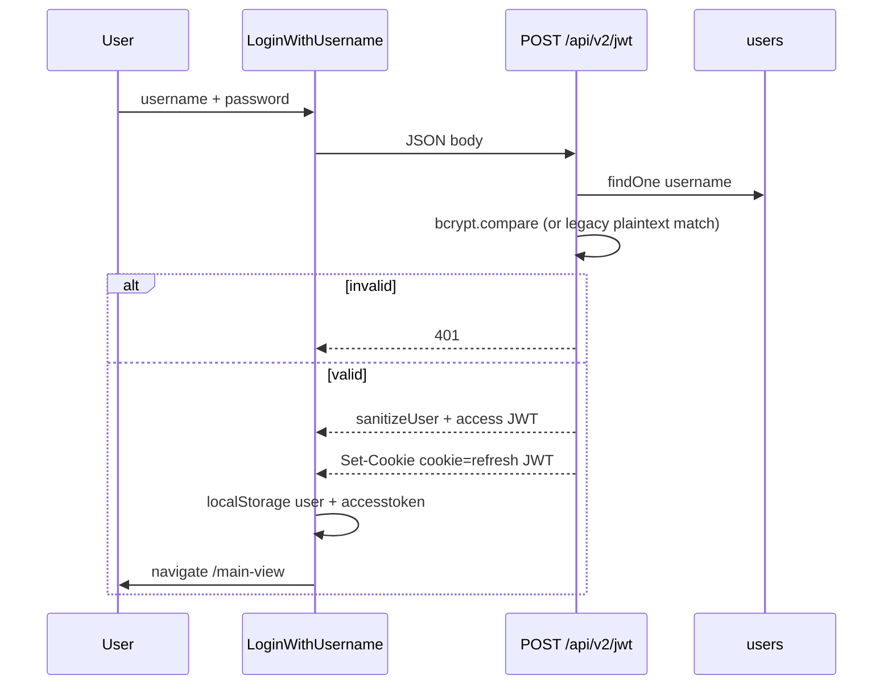

# Authentication and Authorization

## Login flow (implemented)

Active UI: `inventory-management-client/src/pages/Login/LoginWithUsername.js`  
API: `POST /api/v2/jwt` (`inventroy-management-server/src/app/module/auth/auth.service.js` → `userLogin`)



**Request body (required):** `{ username, password }`  
Missing fields → `400`. Unknown user or bad password → `401` with message `Invalid username or password`.

**Success (200):**

```json
{
  "data": { "_id": "...", "username": "...", "menulist": [], "roleId": "..." },
  "success": true,
  "message": "Login successful",
  "token": "<access JWT>"
}
```

`data` is passed through `sanitizeUser`, which **strips `password` and `hashPassword`**.

JWT payload (`buildAuthTokenPayload`): `userId`, `username`, `userRole` (from `roleId`), `isActive`. Passwords are **not** placed in the token.

- Access token TTL: **10 minutes** (`ACCESS_SECRET_TOKEN`)
- Refresh token TTL: **24 hours** (`REFRESH_SECRET_TOKEN`), cookie name **`cookie`**, `httpOnly: true`, `secure: false`, `sameSite: "strict"`, `maxAge: 3600000` (1 hour cookie lifetime — shorter than JWT exp; this mismatch is in the code)

## Refresh token flow

Client: `inventory-management-client/src/redux/api/apiSlice.js` (`baseQueryWithReauth`) and `scheduleTokenRefresh.js`.

1. Requests attach `Authorization: Bearer` from `localStorage.accesstoken`.
2. If the access token is expired (`jwt-decode`), the client POSTs `/api/v2/jwt/refresh-token` with credentials.
3. Server reads `req.cookies.cookie`, verifies with `REFRESH_SECRET_TOKEN`, loads the user, returns a new 10-minute access token and sanitized user.
4. Failure: client shows a warning, clears `localStorage`, redirects to `/`.

`verifyToken` middleware (`app/middlewares/verifyToken.js`) requires **both** the Bearer token and the refresh cookie, and rejects refresh tokens present in an **in-memory** `blacklist` array (`auth/blacklistToken.js`). That blacklist resets when the Node process restarts.

## Logout

`POST /api/v2/jwt/logout` pushes the refresh cookie onto the in-memory blacklist and clears the cookie. The Home page also calls this mutation and clears `localStorage`.

`useInactivityLogout` (`src/components/Customhook/useInactivityLogout.js`) logs the user out after **10 minutes** of inactivity (mousemove/keypress/click), with a 60-second warning dialog, and syncs a warning across tabs via `localStorage`.

## Password hashing

`user.service.js`:

- New/updated passwords are hashed with **bcrypt**.
- `verifyUserPassword` accepts bcrypt hashes on `hashPassword` or `password`.
- If a stored value is **not** a bcrypt hash, it still compares **plaintext equality**. That is a compatibility path for legacy rows, not a recommended practice.

Users may have both `password` and `hashPassword` fields on the schema.

## Protected routes (frontend)

`src/pages/RequireAuth/RequireAuth.js`:

1. Reads `localStorage.user`.
2. Walks `menulist` nested `items` collecting `url` and flags.
3. Matches `window.location.pathname`.
4. Update URLs that contain `update` require `isUpdated`.
5. No match → SweetAlert and redirect to `/main-view`.

Login (`/`) is public. `/main-view` (layout + dashboard index) is **not** wrapped in `RequireAuth`; child feature routes generally are.

## Protected routes (backend)

| Endpoint | Token required in code |
|---|---|
| `GET /api/v1/users/me` | Yes (`verifyToken`) |
| Almost all other routes | **No** global JWT middleware (commented out in `app.js`) |
| `client.route.js` | Imports `verifyToken` but **does not apply it** to handlers |

Authorization for business APIs is therefore **primarily a frontend concern**. Anyone who can reach the API host can call most CRUD URLs unless extra network controls exist outside this repo.

## Roles

Collection `userroles` (`UserRole` model): `userrolename` plus timestamps.  
Users store `roleId` as a string. Sample names in data (not hardcoded in schema): Super Admin, Admin, Account Manager, Store Manager, User.

Roles **do not** carry permission matrices. They are labels. Access is the **menu tree copied onto the user**.

## Menu-based permissions

Menu documents (`menus`) and each user’s `menulist` store nested items with:

| Flag | Typical meaning in UI |
|---|---|
| `isChecked` | Visible / allowed to open the screen |
| `isInserted` | Create |
| `isUpdated` | Update |
| `isRemoved` | Delete |
| `isPDF` | PDF/export |
| `isParent` | Parent node |

Home (`pages/Home/Home.js`) filters `menulist` to `isChecked === true`, drops empty `items` so PrimeReact does not show submenu arrows on leaves, and sorts **parent** labels in a fixed order: Setting → Master Entry → Purchase → Production → Sales → Report.

`extractUserMenuListForCurrectMenu` reads the same flags for report/list toolbars.

There is **no** server-side check that a JWT user may insert a PO or download a PDF.

## Other login files (not the primary path)

`pages/Login/Login.js`, `LoginWithMongodb.js`, `pages/SignUp/*` exist. Production routing in `App.js` uses **`LoginWithUsername` only**.
