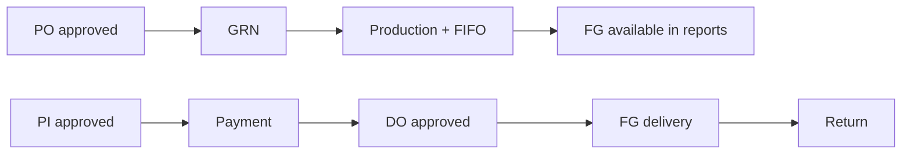

# Business workflows

These flows match UI + services. Stock is **derived in reports**, not a posting ledger.

## Purchase workflow

1. Ensure RM items, units, categories, payment mode, bank, and an **approved** supplier exist.
2. Open **Create PO** (`/main-view/create-po`).
3. Select supplier, currency (`BDT`/`USD`), payment mode, bank, delivery date, lines (item, qty, price).
4. Save → `POST /api/v1/purchaseorderinfo`; client also `POST /api/v1/serial` type `po`.
5. Open **PO approval** (`/main-view/po-approval`) and set `approveStatus`.
6. Unapproved POs cannot be used for GRN in the GRN form (`approveStatus === false` blocked).

**Purchase requisition:** not in the product.

## GRN workflow

1. Open **Create GRN**.
2. Choose an **approved** PO; lines copy PO items and remaining qty (`previousReceivedQuantity`).
3. Enter receive date, supplier challan, quantities.
4. Save → `POST /api/v1/grninfo`; serial type `grn`.
5. Optional: `isAccountPostingStatus` remains a flag; no GL posting module.

## Stock workflow (computed)

**Raw material stock report** (`/stock-report/raw--material-stock-report`): opening stock on RM item + GRN receipts in range − production consumption in range (service in `stockreport.service.js`).

**Finish goods stock report:** opening FG stock + production qty − finish-goods deliveries + returns (same service file).

There is **no** on-hand collection updated on each GRN/production/delivery. Opening stock fields are static until edited on the item master.

## Production workflow

1. Need FG item (`productionQtyPerBatch`), RM items, optional CFT rows for CFT-declared RM.
2. Create production: date, batch no (serial type `production`), FG item, recipe lines, hours, wastage.
3. Status fields: `productionStatus` / line `consumptionStatus` (`No Change`, `Less`, `Excess`).
4. `POST /api/v1/production`.
5. Same save posts FIFO consumption: `POST /api/v1/raw-consumption` referencing `grnDetailsId`.

## Sales workflow

1. Approved **client**, FG items, payment mode.
2. Create **proforma invoice** (`create-invoice`) → `POST /invoiceinfo`; serial type `invoice`.
3. Approve PI (`isApproved`). Delivery UI requires `isApproved === true`.
4. Optional **special approve** on lines (`specialApproveForDelivary`) for LC/special delivery screen.
5. **Payment receive** against PI lines.
6. **Delivery order** from paid/eligible PI; serials `do` and `deliveryChallan`.
7. Approve DO (`approve-status`).
8. **Finish goods delivery** (driver, truck, qty) → updates PI `deliveredQty` and DO `deliveryStatus`.

## Invoice / payment workflow

1. PI lines hold qty and price.
2. Payment receive `detailsData`: method `cash` | `bank-cash` | `bank-cheque`; status `cash` | `advance` | `adjustment`.
3. Bank/cheque/deposit fields required in the form when method is bank.
4. DO form reads payment-receive rows to decide if delivery is allowed (cash vs adjustment logic in `DelivaryOrderCommonInsertPart.js`).

## Return workflow

1. Requires a completed delivery (`deliveredId`, `doId`, `piId`).
2. User enters `returnQty` not exceeding delivered qty (UI).
3. `POST /return-deliver` with `transferFromClientId` and `transferToCompanyId`.
4. Return report endpoints aggregate `returndeliveredinformation`.
5. FG stock report includes returns as inbound.

