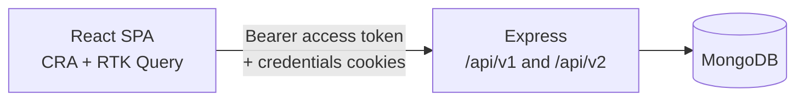
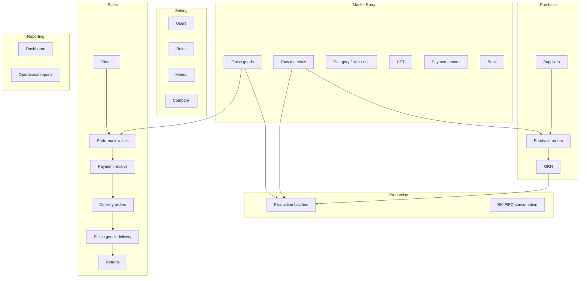

# Project Overview

## Purpose

This application is a **web-based inventory and operations system** for a manufacturing business (UI copy, company records, and CORS origins refer to brick/concrete products). It supports master data, purchasing, goods receipt, production with raw-material consumption, sales (proforma invoice through delivery and payment), returns, and operational reports.

It is **not** a full accounting/GL package. Some documents have flags such as `isAccountPostingStatus` and `ledgerApproveStatus`, but there is no separate Accounts module or chart-of-accounts implementation in this repository.

## Main business objectives (from implemented modules)

- Maintain item, partner, and company master data.
- Raise and approve purchase orders and receive goods (GRN).
- Record production batches and raw-material consumption (including FIFO consumption rows).
- Sell finished goods via proforma invoices, payments, delivery orders, and physical delivery.
- Record customer returns of delivered goods.
- Produce date-filtered operational reports and a dashboard of purchase, consumption, production, and sales.

## Key features that exist

- Username/password login with bcrypt verification, JWT access token, and refresh cookie.
- Nested **menu** configuration and **per-user menu permissions** (`isChecked`, `isInserted`, `isUpdated`, `isRemoved`, `isPDF`).
- Frontend route guard (`RequireAuth`) using those menu URLs.
- CRUD (or insert/list) for users, roles, menus, items, suppliers, clients, CFT, payments, banks, company.
- Purchase orders with cash/LC lists and approve/unapprove lists.
- GRN against purchase orders.
- Production entry plus FIFO consumption detail collection.
- Sales: invoice (PI), special-delivery approval, payment receive, delivery order, finish-goods delivery, returns.
- Document serial numbers (`serialnogenerate`).
- Reports: sales/order/return, purchase, production, consumption, combine, FIFO consumption, RM/FG stock.
- Dashboard cards and charts with **last-two-months** default date range.
- Client-side PDF (jsPDF) and Excel (ExcelJS) export on report screens.
- Development seed script: `inventroy-management-server/scripts/seed-dev-inventory.js`.

## Features requested in generic ERP lists that are **not** implemented

| Topic | Status in this codebase |
|---|---|
| Purchase Requisition | Not found (no model/route/UI) |
| Gate pass / Issue note | Not found |
| Warehouse sections / departments as master data | Not found (roles exist as names only) |
| Dedicated stock ledger collection | Not found; stock reports **compute** from GRN, production, delivery, returns, and item opening stock |
| Tailwind CSS / daisyUI application styling | Not used; UI is Bootstrap + PrimeReact |
| Prisma / PostgreSQL | Not used; MongoDB/Mongoose only |
| Firebase Auth as the login path | `src/lib/firebase.js` initializes Firebase Auth but login uses the Express JWT API |

## Overall architecture

- **Frontend:** single-page app. Session user JSON (without password) is stored in `localStorage` (`user`); access token in `localStorage` (`accesstoken`).
- **Backend:** Express app (`src/app.js`) connects via Mongoose (`src/server.js`). Modules follow route → controller → service → model.
- **Auth:** POST `/api/v2/jwt` issues a 10-minute JWT and a 24-hour refresh token in an httpOnly cookie named `cookie`. Most REST routes are **not** wrapped in `verifyToken` (that global wrap is commented out). `GET /api/v1/users/me` does require a token.

## High-level module map

